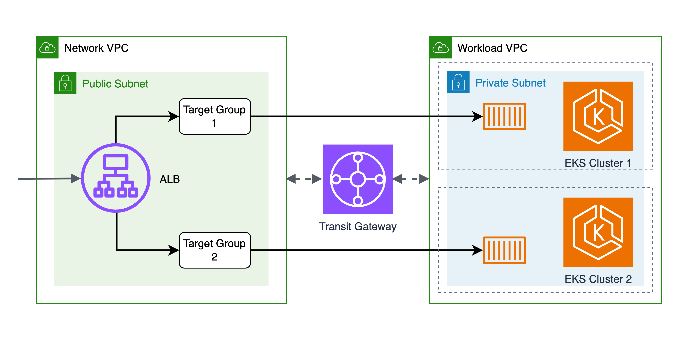

# EKS Clusters with Shared Subnets

This demo demonstrates an architecture for having 2 Amazon EKS clusters with shared networking resources and blue/green deployment & upgrade capabilities.

It provides a solution for organizations that need to deploy 2 EKS cluster on the same VPC, while addressing some potential challenges/limitations, including:

- Not having enough IP range left on the VPC to allocate the additional private subnets for the 2nd EKS cluster
- Wanting to not have additional secondary CIDR or VPC for worker nodes (which potentially requires more adjustments on Transit Gateway and other VPCs)
- Having the requirement to not change the ALBs/NLBs endpoint during the blue/green deployment & upgrade
- Wanting to reduce the no. of ALBs/NLBs in the workload account

## Architecture Overview



- On networking account, ALB with 2 target groups, one for each EKS cluster
- On workload account, 10.1.0.0/24 primary CIDR for worker node IPs and 100.64.0.0/16 secondary CIDR for pod IPs
- On EKS cluster, TargetGroupBinding CRD for binding pod IPs to target group in the network account

Note. For simplicity, this demo uses VPC peering instead of Transit Gateway to connect 2 VPCs.

## Prerequisites

Before you begin, ensure you have the following tools installed:

- [AWS CLI](https://docs.aws.amazon.com/cli/latest/userguide/getting-started-install.html)
- [Terraform](https://www.terraform.io/downloads) (>= 1.10)
- [kubectl](https://kubernetes.io/docs/tasks/tools)

## Quick Start

1. Initialize and deploy the infrastructure:

```bash
terraform init
./apply.sh
```

2. Configure kubectl to access your EKS cluster:

```bash
aws eks update-kubeconfig --region ap-southeast-1 --name eks-shared-subnets-1
```

For the other cluster:

```bash
aws eks update-kubeconfig --region ap-southeast-1 --name eks-shared-subnets-2
```

3. Verify the deployment:

```bash
kubectl get pods -n blue/green
kubectl get nodes
```

## Architecture Components

### Network Module (network folder)

**Purpose**: Creates the infrastructure for the networking account

**Key Resources**:

- **VPC**: 10.0.0.0/24 CIDR and with public/private subnets across 3 AZs
- **Application Load Balancer**: Internet-facing ALB with HTTP listener
- **Target Groups**: Two target groups for blue/green deployments
- **IAM Role**: Cross-account role for target group binding

**Outputs**:

- VPC ID and CIDR for workload module
- Target group ARNs for application registration
- IAM role ARN for cross-account access

### Workload Module (workload folder)

**Purpose**: Creates the infrastructure for the workload account

**Key Resources**:

- **VPC**: 10.1.0.0/24 primary CIDR and 100.64.0.0/16 secondary CIDR and with private subnets across 3 AZs
- **EKS Cluster**: Cluster with public endpoint
- **AWS Load Balancer Controller**: Manages target group bindings
- **Application Deployment**: blue/green app with configurable color

**Kubernetes Manifests**:

- **NodeClass**: Custom node class with subnet/security group selectors
- **Service**: ClusterIP service for internal communication
- **TargetGroupBinding**: Cross-account ALB target registration

### VPC Peering Module (vpc-peering folder)

**Purpose**: Connects network and workload VPCs

**Key Resources**:

- **VPC Peering Connection**: Auto-accepted peering between VPCs
- **Route Tables**: Bidirectional routing for ALB-to-pod communication

## Blue/Green Deployment

The project implements weighted traffic routing for blue/green deployments:

Configure traffic weights in `main.tf`:

```hcl
module "network" {
  source = "./network"

  target_group_1_weight = 100  # Blue deployment (100%)
  target_group_2_weight = 0    # Green deployment (0%)
}
```

## Cleanup

Use the provided destroy script:

```bash
./destroy.sh
```

## Disclaimer

⚠️ **This repository is intended for demonstration and learning purposes only.**
It is **not** intended for production use. The code provided here is for educational purposes and should not be used in a live environment without proper testing, validation, and modifications.

Use at your own risk. The authors are not responsible for any issues, damages, or losses that may result from using this code in production.

Check [Security Considerations](SECURITY.md) for more information on the security scans.

## Contributing

Contributions welcome! Please read our [Contributing Guidelines](CONTRIBUTING.md) and [Code of Conduct](CODE_OF_CONDUCT.md) for more information.

## License

This project is licensed under the MIT License - see [LICENSE](LICENSE) file.
